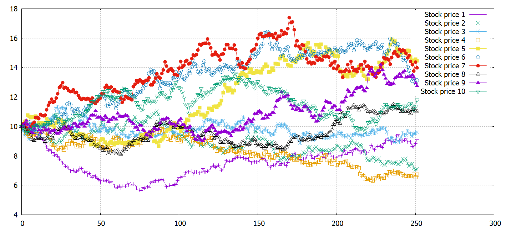
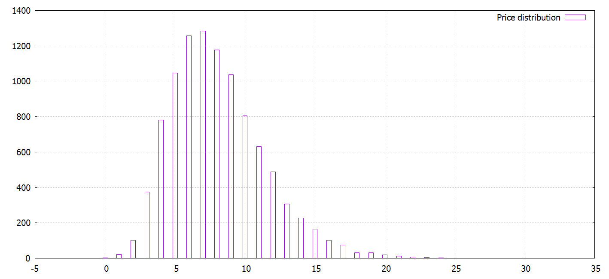

# financial-maths
Collection of programs for financial mathematics and statistics. Most of the Python is developed during lectures on the topic, and thus it can be quite hacky at times. The C++ code is developed after the lectures at home, and thus is prettier. The goal is to eventually refactor all hacky Python into nice and scalable C++.

## Example outputs from the C++ code
Below are some example outputs.

### Multiple stock path simulation

Multiple paths are simulated here. These show some possible paths for a given stock based on an upward drift (expected return > 0). Higher expected return makes the stock drift upwards more on average, while higher volatility makes the variance in the outputs larger.

### Terminal prices

This image shows the distribution of possible terminal prices for the stock based on the model explained above. However, there are way more possible paths simulated here, 10 000 to be exact. The most important part of this graph is that *the terminal stock prices are log-normally distributed even though the stock adheres to a normal distribution*. This stems from the stock dynamics, and the general solution to the stock dynamics equation. The intuitive explanation is that the stock is expected to increase every step by a constant rate, and hence the "interest on interest" effect is created (even though this model does not take interest into account).

Now, an increace in the expected rate of return shifts the distribution to the right and an increace on market volatility flattens and spreads the distribution. Because the distribution is mostly on the left, it is possible that *even though expected rate of return is positive, it might be more likely (over 50 %) to lose money, if the volatility is high*.

## Installation and running
The C++ is simply compiled with qmake and then running the executable.

All Python files are independent and do not import from each other. They can be simply run on the command line. Most use some of the common data science Python libraries such as
* `numpy`
* `matplotlib`
* `scipy`
* `pandas`

I will add more documentation to the Python files once I have time.
